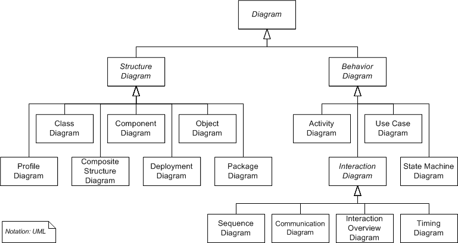
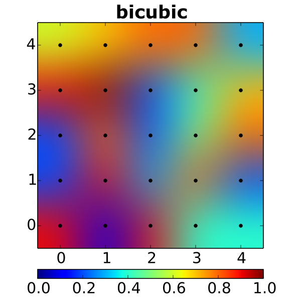

#  Error Free Programming or Error Prevention?


## The Holy Grail


```
int i = 1;
```
. . .


<center>
**any more code might introduce errors!**
</center>


## Motivation

<center>
  
</center>


## Outline

<div style="font-size : 1.5em">

<center>
1. Code Context

2. Good Code prevents Errors

3. Redundat Code

4. Dynamic State
</center>

</div>


# Code Context

## Cognitive Load

<div style="font-size : 5em">
<center>
**7 +/- 2**
</center>
</div>

<center>
  
  
  
(George A. Miller; The magical number seven plus or minus two; Some limits on our capacity for processing informations; Psychological Review 63 8 (1956), S. 81–97)
</center>


## A (Scientific) Programmer changing code


## code workload

- where to apply change
- change propagation (dependencies)
- requirements to consider when applying a change

<center>

</center>


## desktop workload

- answering emails
- answering walk-in requests  
- pressure of deliverables

<center>

</center>


## editor workload

- keyboard short-cuts, menue structure
- syntax to use (programming language, programming paradigms)
- library semantics and API

<center>

</center>


## scientific workload

- academic context (time and hierarchy pressure)
- scientific context (what problem do I wanna solve?)

<center>

</center>


## A (Scientific) Programmer changing code ...

<div style="font-size : 3em">
<center>
is almost always crossing the *7 +/- 2* barrier.
</center>
</div>


## Possible Solutions

* manage your time (e.g. Pomodoro, Getting-Things-Done)

. . . 

* keep your head free to solve the problem

    - no extensive working hours
	
    - use leisure to relax (not to work)
	
. . .
	
* Test-Driven Development (TDD)

    1. write failing test for feature (red)
    2. add implmenentation and make test pass (green)
    3. Refactor to achieve good design while all tests pass (refactor)
    4. return to 1.


# Good Code prevents Errors

## Clean Code Movement

<center>
  
</center>


Robert C. Martin, "Clean Code: A Handbook of Agile Software Craftsmanship", 2008, Prentice Hall


## Write Readable Code

* naming a variables/class/function in a readable fashion, improves system design
* requires exercise and discipline
* _can't find a good name?_

. . . 

**Maybe your mental model is defective or not complete!**

. . . 

* _can't change the variable/function/class name in a project easily?_

. . . 

**Maybe your editor is not supporting you enough!**


## Type Systems are your friend

* helps compiler to find bugs before they happen
* may induce boiler plate code (i.e. code necessary for the compiler only)
* good type system helps to construct application logic with domain-specific types so that unrequired states lead to compiler errors
* example: special case handling with null references


## Newsletter example


```
case class Person(name: String, email: String)

trait Newsletter {

  val persons: List[Person]

  def sendNewsletterTo(email: String): Unit

  def sendNewsletter: Unit = {

    for (person <- persons)
      if (person.email != null) //please remember this!
        sendNewsletterTo(person.email)
  }
}

```


## Newsletter discussion


* simple example, check for `null` is hard to forget

* in complex real scenario, `null` check can be forgotten easily

	- defensive profgramming: check state everywhere (if-elseif-else madness)
    - problem: code becomes unreadable

* alternatives: 

    - use optional data types (yields None and StringType as sub types)
    - subclassing: Person class with email, Person class without email


## Newsletter Solution


```
case class Person(name: String, email: Option[String])

trait Newsletter {

  val persons: List[Person]

  def sendNewsletterTo(email: String): Unit

  def sendNewsletter: Unit = {

    for (person <- persons)
      person.email foreach sendNewsletterTo 
  }
}
```


# Redundant code  


## Copy & Paste


- easy and quick fix
- a lot of technical debt accumulated
- future change: has to be propagated to many places

- **don't copy&paste, but abstract**  

	- minor changes should induce new functions/subclasses
	- in practice often doable but hard


## Copy & Paste, Example 1


```
def getNumPersons(query: PreparedStatement): Long = {
  val results = query.executeQuery
  try {
    results.next
    return results.getLong("numPersons")
  } finally {
    results.close
  }
}
```

## Copy & Paste, Example 2


```
def getNumPersonsNamed(

    name: String, query: PreparedStatement): Int = {
  query.setString(1, name)
  val results = query.executeQuery
  try {
    results.next
    return results.getInt("numNamedPersons")
  } finally {
    results.close
  }
}
```


## Copy & Paste, Solution

- Template Method Pattern (GoF Pattern, class architecture for query)
- Higher-Order Functions using lamdas (functional approach)

**preventing copy&paste is doable!**


# Dynamic State  


## State


- state base programming from a time, where state was mapped to memory (due to memory being scarce)

- today: memory not a problem, topics like parallelisation are important

- dynamic state induces complexity, complexity is hard to test (compare bigger/normal classes to functions)

**Avoid state whereever possible!**


## State in Real Life

- state required in many cases

    - i/o
	- events from a GUI
	- data base access

- new trends emerge:

    - reactive programming
	- data bases with event based records (journal of data changes is kept)
	- persistent data structures (system knows changes to data, always trackable, e.g. Spark)
	

# Summary  


* software development is a cognitive demanding activity

* techniques exist to reduce complexity

* by reducing complexity, ease cognitive load 
  
* less cognitive load, less errors


  
