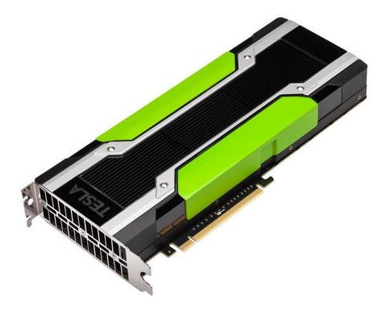
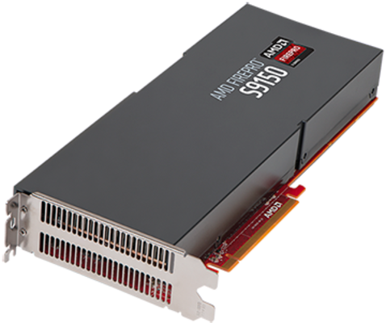

# Before I start

## Scionics Who?

[columns,class="row vertical-align"]

[column,class="col-xs-6"]

  
[Scionics Computer Innovation GmbH](scionics.de)

[/column]

[column,class="col-xs-6"]

- founded in 2000, Dresden (Germany)
- service provider to the [Max Planck Institute of Molecular Cell Biology and Genetics](mpi-cbg.de)  

    - scientific computing facility
    - IT infrastructure
    - public relations

[/column]

[/columns]

## Why parallel2017?

[columns,class="row"]

[column,class="col-xs-4"]

Nvidia Tesla  

[/column]

[column,class="col-xs-4"]

AMD FirePro  

[/column]

[column,class="col-xs-4"]

Intel MIC  

[/column]

[/columns]

**What should our clients choose?**

## Why I present?

<video width="1400" poster="video/Celegans_lateral_one_view_versus_deconvolved.png" controls loop>
<source src="video/Celegans_lateral_one_view_versus_deconvolved.webm" type='video/webm; codecs="vp8.0, vorbis"'>
<source src="video/Celegans_lateral_one_view_versus_deconvolved.mp4" type='video/mp4'>

Movie does not work! Sorry!

</video>

*Accelerating [our clients' scientific algorithms](http://www.nature.com/nmeth/journal/v11/n6/full/nmeth.2929.html) on [GPUs](https://github.com/psteinb/gtc2015.git)  
(multi-GB dataset, a lot of FFTs)*

## This Talk is Open-Source!

  

**[github.com/psteinb/parallel2017](https://github.com/psteinb/parallel2017)**

