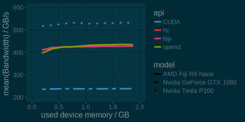
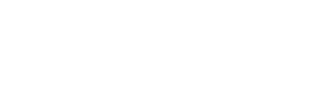

# Before I start


## Scionics Who?

[columns,class="row vertical-align"]

[column,class="col-xs-6"]

  
[Scionics Computer Innovation GmbH](https://www.scionics.com/)

[/column]

[column,class="col-xs-6"]

- founded in 2000, Dresden (Germany)
- service provider to the [Max Planck Institute of Molecular Cell Biology and Genetics](https://www.mpi-cbg.de/home/)  

    - scientific computing facility
    - IT infrastructure
    - public relations

[/column]


[/columns]


## Why parallel2017?


[columns,class="row"]

[column,class="col-xs-4"]

<center>
Nvidia Tesla  

</center>

[/column]

[column,class="col-xs-4"]

<center>
AMD FirePro  

</center>

[/column]

[column,class="col-xs-4"]

<center>
Intel MIC  

</center>

[/column]

[/columns]


<center>

**What should our clients choose?**

</center>


## Why I present?

<center>

<video width="1400" poster="video/Celegans_lateral_one_view_versus_deconvolved.png" controls loop>
<source src="video/Celegans_lateral_one_view_versus_deconvolved.webm" type='video/webm; codecs="vp8.0, vorbis"'>
<source src="video/Celegans_lateral_one_view_versus_deconvolved.mp4" type='video/mp4'>
<p>Movie does not work! Sorry!</p>
</video>


*Accelerating [our clients' scientific algorithms](http://www.nature.com/nmeth/journal/v11/n6/full/nmeth.2929.html) on [GPUs](https://github.com/psteinb/gtc2015.git)  
(multi-GB dataset, a lot of FFTs)*

</center>


## This Talk is

<center>
  

**[github.com/psteinb/parallel2017](https://github.com/psteinb/parallel2017)**
</center>

## This Talk != Advertisement 

- Our company is by no means financially tied to AMD nor any of it's resellers.
- AMD provided test hardware and that's it
- whatever I find missing or not working, I'll report it here

&nbsp;

<center>
**Use the [issue tracker](https://github.com/psteinb/parallel2017/issues) of this talk to correct me!**

[github.com/psteinb/parallel2017](https://github.com/psteinb/parallel2017)
</center>


## Outline

<div style="font-size : 1.5em">

<center>
1. ROCm

2. Porting Code from CUDA

3. HC
</center>

</div>


# ROCm

## Radeon Open Compute Platform 

[columns,class="row"]

[column,class="col-xs-4"]

[](http://gpuopen.com/compute-product/rocm/)  

[/column]

[column,class="col-xs-8"]

[/column]

- very young:  
*April 25th, 2016*, version 1.0
- 3 main components:

    - [ROCm](http://gpuopen.com/compute-product/rocm/) Linux kernel driver 
    - [ROCr](https://github.com/RadeonOpenCompute/ROCR-Runtime) runtime & library stack
    - [HCC](https://github.com/RadeonOpenCompute/hcc) compiler based on LLVM  

<center>
**Open Source!**
</center>

[/columns]

## ROCm kernel driver

[columns,class="row"]

[column,class="col-xs-4"]

[](http://www.amd.com/en-us/innovations/software-technologies/gcn)  

[/column]

[column,class="col-xs-8"]

<center>

- supported GPUs: GFX8 GPU's ( Fiji & Polaris Family)
- supported CPUs:

	- Intel Xeon E3/E5, Core i3/5/7 Haswell or newer
	- (upcoming) AMD Naples/Ryzen
	- (upcoming) Cavium Thunder X ARM

&nbsp;

</center>


[/column]

[/columns]

. . . 


[columns,class="row"]

[column,class="col-xs-4"]

- large memory single allocation   
(>32GB in one pointer)

[/column]

[column,class="col-xs-4"]

- peer-to-peer Multi-GPU, RDMA

[/column]

[column,class="col-xs-4"]

- systems management API and tooling

[/column]

[/columns]


## ROCr runtime

[columns,class="row-fluid"]

[column,class="col-xs-4"]

<center>
[](http://www.hsafoundation.com/)  
</center>

[/column]


[column,class="col-xs-8"]

[/column]

- AMD's implementation of HSA runtime  
(+ extensions for multi-GPU)
- user mode queues
- flat memory addressing
- atomic memory transactions & signals
- process concurrency & preemption
- device discovery

[/columns]


## Heterogenous Compute Compiler

[columns,class="row"]

[column,class="col-xs-4"]

<center>
[](http://www.hsafoundation.com/)  
</center>

[/column]

[column,class="col-xs-8"]


- [hcc](https://github.com/RadeonOpenCompute/hcc) compiler for supported APIs
- LLVM native GCN ISA code generation
- offline compilation support
- standardized loader and code object format
- GCN ISA assembler and disassembler
- OpenMP, HIP, HC and OpenCL programming interface   
(OpenMP4 accelerator offloading in development)


[/column]

[/columns]


## Prologue

<center>

 ](img/github_gpu_stream.png){ width=90% }

</center>

## [UoB-HPC/GPU-STREAM](https://github.com/UoB-HPC/GPU-STREAM)

```
/* add   */ c[:]    = a[:]
/* mul   */ b[:]    = scalar*b[:]
/* copy  */ c[:]    = a[:] + b[:]
/* triad */ a[:]    = b[:] + scalar*c[:] 
/* dot   */ scalar  = dot(a[:],b[:])
```

&nbsp;

<center>

- benchmark of various programming paradigms:  
  OpenMP3, OpenMP4, CUDA, Kokkos, Raja, OpenCL, ...
- for now *nix only

</center>


# Porting Code from CUDA


## Hipify

[columns, class="row"]

[column,class="col-xs-4"]

<center>

{ width=50% }

</center>

[/column]


[column,class="col-xs-8"]

- Convert CUDA to portable C++, `hipify`
- C++ kernel language ( C++11/14/17 features )
- C runtime API
- same performance as native CUDA

. . . 

&nbsp;

- supports *most commonly* used parts of CUDA:  
  streams, events, memory (de-)allocation, profiling

- produced apps have full tool support:
    - CUDA: nvcc, nvprof, nvvp
    - ROCM: hcc, rocm-prof, codexl

[/column]
  
[/columns]


## [CUDA Example](https://github.com/UoB-HPC/GPU-STREAM/blob/master/CUDAStream.cu#L149)


```
__global__ void add_kernel(const T * a, 
                           const T * b, 
                           T * c){
  const int i = blockDim.x * blockIdx.x + threadIdx.x;
  c[i] = a[i] + b[i];}

void CUDAStream<T>::add(){
  add_kernel<<<array_size/TBSIZE, TBSIZE>>>(d_a, d_b, d_c);
  check_error();  //..
  }
```

## [Hip`ified Example](https://github.com/UoB-HPC/GPU-STREAM/blob/master/HIPStream.cpp#L152)

```
__global__ void add_kernel(hipLaunchParm lp, 
                           const T * a, const T * b, 
                           T * c){
  const int i = hipBlockDim_x * hipBlockIdx_x + hipThreadIdx_x;
  c[i] = a[i] + b[i];
}

void HIPStream<T>::add(){
  hipLaunchKernel(HIP_KERNEL_NAME(add_kernel), 
                  dim3(array_size/TBSIZE), dim3(TBSIZE), 0, 0, 
                  d_a, d_b, d_c);  check_error();  //...
}
```

## HIP summary

- very interesting tool to get started with production or legacy code

- still low-level CUDA programming

- HIP library eco-system available as well: [hipBlas](https://bitbucket.org/multicoreware/hcblas), [hipFFT](https://bitbucket.org/multicoreware/hcFFT), [hipRNG](https://bitbucket.org/multicoreware/hcrng), ...


# Heterogenous Compute

## HC

- C++ parallel runtime and [API](https://scchan.github.io/hcc/index.html)
- based on C++AMP in `hc` namespace plus C++14
- (asynchronous) copy commands for host-device i/o
- explicit pointer-based memory allocation (am_alloc / am_free)
- hc::accelerator_view, hc::array_view, hc::completion_future
- device specific 'instrinsics' (wavefront shuffle, bit extraction, atomics)


<center>
&nbsp;

**Very similar to [thrust](http://thrust.github.io/), [boost.compute](https://github.com/boostorg/com), [sycl](https://www.khronos.org/sycl).**
</center>

## HC API Overview

<center>
{ width=80% }
</center>


## HC in [GPU-STREAM](https://github.com/UoB-HPC/GPU-STREAM), Declaration

```
#include "Stream.h"
#include "hc.hpp"

template <class T>
class HCStream : public Stream<T>
{
protected:
  unsigned int array_size;
  hc::array<T,1> d_a;
  hc::array<T,1> d_b;
  hc::array<T,1> d_c;
  //...
```

## HC in [GPU-STREAM](https://github.com/UoB-HPC/GPU-STREAM), Init Data

```
template <class T>
void HCStream<T>::init_arrays(T _a, T _b, T _c)
{
    hc::array_view<T,1> view_a(this->d_a);
    hc::parallel_for_each(hc::extent<1>(array_size)
                                , [=](hc::index<1> i) [[hc]] {
                                  view_a[i] = _a;
                                });
    //...
```

## HC in [GPU-STREAM](https://github.com/UoB-HPC/GPU-STREAM), Run Kernel

```
template <class T>
void HCStream<T>::add()
{
    hc::array_view<T,1> view_a(this->d_a);
    hc::array_view<T,1> view_b(this->d_b);
    hc::array_view<T,1> view_c(this->d_c);

    hc::parallel_for_each(hc::extent<1>(array_size)
                                , [=](hc::index<1> i) [[hc]] {
                                  view_c[i] = view_a[i]+view_b[i];
								});
```

## Let's compare the results

<center>
{ width=80% }
</center>

## Comparing to HBM2 and GDDR5

<center>
{ width=90% }
</center>


## HC can be low-level too ([WIP](https://github.com/psteinb/GPU-STREAM/blob/rocm_hc_support/HCStream.cpp))

```
hc::parallel_for_each(tiled_ex,
					  [=,
					  &view_a,
					  &view_b,
					  &partial](const hc::tiled_index<1>& tidx) [[hc]] {

	auto gidx = tidx.global[0];
	T r = T{0}; // Assumes reduction op is addition.
	while (gidx < view_a.get_extent().size()) {
		r += view_a[gidx] * view_b[gidx]; //dot-product
		gidx += domain_sz;
	}

	tile_static T tileData[TBSIZE];
	tileData[tidx.local[0]] = r;

	tidx.barrier.wait_with_tile_static_memory_fence();

	for (auto h = TBSIZE / 2; h; h /= 2) {
		if (tidx.local[0] < h) {
			tileData[tidx.local[0]] += tileData[tidx.local[0] + h];
		}
		tidx.barrier.wait_with_tile_static_memory_fence();
	}

	if (tidx.global == tidx.tile_origin) partial[tidx.tile] = tileData[0];
```

## Concurrency constructs 

- asynchronous operations (memory copies, kernel launches) return completion future

```
std::vector<float> payload  (/*pick a number*/);
hc::array<float,1> d_payload(payload.size());
hc::completion_future when_done = hc::async_copy(payload.begin(),
	payload.end(),
	d_payload);
when_done.then(call_kernel_functor); //continuation function!
```
. . .

- for me hc::completion_future::then API not production ready yet:

```
template<typename functor >
void 	then (const functor &func);//just a callback for now
```

## Concurrency TS?

```
for(hc::completion_future when_done : streams){
	when_done = hc::async_copy(payload_begin_itr,
	payload_end_itr,
	d_payload_itr);
	when_done.then(parallel_for_each(/*do magic*/))
		     .then(hc::async_copy());
}

hc::when_all(streams);
```

<center>
concurrency constructs are the glue code of host-device interactions!

(see [when_all](http://www.open-std.org/jtc1/sc22/wg21/docs/papers/2015/n4399.html#futures.when_all), [co_await](http://www.open-std.org/jtc1/sc22/wg21/docs/papers/2016/p0057r3.pdf) and friends)
</center>

# Summary

## What I learned so far

- AMD's ROCm/ROCr stack is a very young and ambitious project
- full open-source driver, runtime and compiler for dGPU
- `hc` API is expressive and reduces boiler-plate code
- ecosystem and tooling are not there yet for production (HPC) codes

&nbsp;

<center>
**Open-source driver, runtime stack, compiler and language for GPU computing is an interesting approach to keep an eye on!**
</center>


## What I observe

- CUDA/OpenCL as the community's working horse are low-level and enforce a lot of boiler plate
- [thrust](http://thrust.github.io/), [boost.compute](https://github.com/boostorg/com), [sycl](https://www.khronos.org/sycl), [hc](https://scchan.github.io/hcc/index.html) encapsulate this  
  (sometimes at the expense of feature parity)
- [C++17 parallelism extensions](https://herbsutter.com/2017/03/24/trip-report-winter-iso-c-standards-meeting-kona-c17-is-complete/) and C++20 concurrency good for multi-core
- hoping for a solid parallel STL with solid vendor specific C++ interfaces

## My Hopes and Acks

<center>
{ width=80% }
</center>
. . . 

<center>
**Thank you for your attention!**
</center>

<center>
(Thanks to [Ben Sander](mailto:ben.sander@amd.com) and [Alex Voicu](mailto:Alexandru.Voicu@amd.com) for their valuable feedback!)
</center>
