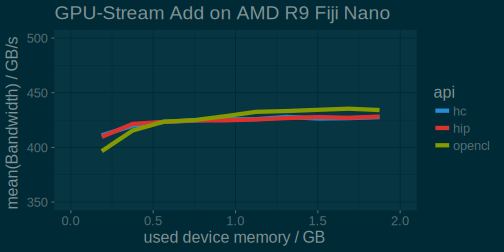

# Before I start


## Scionics Who?

[columns,class="row vertical-align"]

[column,class="col-xs-6"]

  
[Scionics Computer Innovation GmbH](scionics.de)

[/column]

[column,class="col-xs-6"]

- founded in 2000, Dresden (Germany)
- service provider to the [Max Planck Institute of Molecular Cell Biology and Genetics](mpi-cbg.de)  

    - scientific computing facility
    - IT infrastructure
    - public relations

[/column]


[/columns]


## Why parallel2017?


[columns,class="row"]

[column,class="col-xs-4"]

<center>
Nvidia Tesla  

</center>

[/column]

[column,class="col-xs-4"]

<center>
AMD FirePro  

</center>

[/column]

[column,class="col-xs-4"]

<center>
Intel MIC  

</center>

[/column]

[/columns]


<center>

**What should our clients choose?**

</center>


## Why I present?

<center>

<video width="1400" poster="video/Celegans_lateral_one_view_versus_deconvolved.png" controls loop>
<source src="video/Celegans_lateral_one_view_versus_deconvolved.webm" type='video/webm; codecs="vp8.0, vorbis"'>
<source src="video/Celegans_lateral_one_view_versus_deconvolved.mp4" type='video/mp4'>
<p>Movie does not work! Sorry!</p>
</video>


*Accelerating [our clients' scientific algorithms](http://www.nature.com/nmeth/journal/v11/n6/full/nmeth.2929.html) on [GPUs](https://github.com/psteinb/gtc2015.git)  
(multi-GB dataset, a lot of FFTs)*

</center>


## This Talk != Advertisement 

<center>
**AMD provided test hardware and that's it!**
</center>


- Our company is by no means financially tied to AMD nor any of it's resellers.

- whatever I find missing or not working, I'll report it here
(use the [issue tracker](https://github.com/psteinb/parallel2017/issues) of this talk to correct me)


## This Talk is


<center>
  

**[github.com/psteinb/parallel2017](https://github.com/psteinb/parallel2017)**
</center>


## Outline

<div style="font-size : 1.5em">

<center>
1. ROCm

2. Porting Code from CUDA

3. HC
</center>

</div>


# ROCm

## Radeon Open Compute Platform 

[columns,class="row"]

[column,class="col-xs-4"]

[](http://gpuopen.com/compute-product/rocm/)  

[/column]

[column,class="col-xs-8"]

[/column]

- very young:  
*April 25th, 2016*, version 1.0
- 3 main components:

    - [ROCm](http://gpuopen.com/compute-product/rocm/) Linux kernel driver 
    - [ROCr](https://github.com/RadeonOpenCompute/ROCR-Runtime) runtime & library stack
    - [HCC](https://github.com/RadeonOpenCompute/hcc) compiler based on LLVM  

<center>
**Open Source!**
</center>

[/columns]

## ROCm kernel driver

[columns,class="row"]

[column,class="col-xs-4"]

[](http://www.amd.com/en-us/innovations/software-technologies/gcn)  

[/column]

[column,class="col-xs-8"]

[/column]

<center>

- large memory single allocation   
(>32GB in one pointer)
- peer-to-peer Multi-GPU
- peer-to-peer with RDMA
- systems management API and tooling

</center>

[/columns]


## ROCr runtime

[columns,class="row-fluid"]

[column,class="col-xs-4"]

<center>
[](http://www.hsafoundation.com/)  
</center>

[/column]


[column,class="col-xs-8"]

[/column]

- AMD's implementation of HSA runtime  
(+ extensions for multi-GPU)
- user mode queues
- flat memory addressing
- atomic memory transactions & signals
- process concurrency & preemption
- device discovery

[/columns]


## Heterogenous Compute Compiler

[columns,class="row"]

[column,class="col-xs-4"]

<center>
[](http://www.hsafoundation.com/)  
</center>

[/column]

[column,class="col-xs-8"]

[/column]

- [hcc](https://github.com/RadeonOpenCompute/hcc) compiler for supported APIs
- LLVM native GCN ISA code generation
- offline compilation support
- standardized loader and code object format
- GCN ISA assembler and disassembler
- HIP, HC and OpenCL programming interface

[/columns]


# Porting Code from CUDA


## Prologue

<center>

 ](img/github_gpu_stream.png){ width=90% }

</center>

## [UoB-HPC/GPU-STREAM](https://github.com/UoB-HPC/GPU-STREAM)

```
/* add   */ c[:]    = a[:]
/* mul   */ b[:]    = scalar*b[:]
/* copy  */ c[:]    = a[:] + b[:]
/* triad */ a[:]    = b[:] + scalar*c[:] 
/* dot   */ scalar  = dot(a[:],b[:])
```
  

<center>

- benchmark of various programming paradigms:  
  OpenMP3, OpenMP4, CUDA, Kokkos, Raja, OpenCL, ...
- for now *nix only

</center>

## Hipify

[columns, class="row"]

[column,class="col-xs-4"]

<center>

{ width=65% }

</center>

[/column]


[column,class="col-xs-8"]

- Convert CUDA to portable C++, `hipify`
- C++ kernel language ( C++11/14/17 features )
- C runtime API
- same performance as native CUDA

. . . 

&nbsp;

- supports *most commonly* used parts of CUDA:  
  streams, events, memory (de-)allocation, profiling

- produced apps have full tool support:
    - CUDA: nvcc, nvprof, nvvp
    - ROCM: hcc, rocm-prof, codexl

[/column]
  
[/columns]


## [CUDA Example](https://github.com/UoB-HPC/GPU-STREAM/blob/master/CUDAStream.cu#L149)


```
__global__ void add_kernel(const T * a, 
                           const T * b, 
                           T * c){
  const int i = blockDim.x * blockIdx.x + threadIdx.x;
  c[i] = a[i] + b[i];}

void CUDAStream<T>::add(){
  add_kernel<<<array_size/TBSIZE, TBSIZE>>>(d_a, d_b, d_c);
  check_error();  //..
  }
```

## [Hip`ified Example](https://github.com/UoB-HPC/GPU-STREAM/blob/master/HIPStream.cpp#L152)

```
__global__ void add_kernel(hipLaunchParm lp, 
                           const T * a, 
                           const T * b, 
                           T * c){
  const int i = hipBlockDim_x * hipBlockIdx_x + hipThreadIdx_x;
  c[i] = a[i] + b[i];
}

void HIPStream<T>::add(){
  hipLaunchKernel(HIP_KERNEL_NAME(add_kernel), 
                  dim3(array_size/TBSIZE), dim3(TBSIZE), 0, 0, 
                  d_a, d_b, d_c);  check_error();  //...
}
```

## HIP summary

- very interesting tool to get started with production or legacy code

- still low-level CUDA programming

- HIP evosystem available as well: hipBlas, hipFFT, hipRNG, MIOpen (machine learning library)


# Heterogenous Compute

## HC

- C++ parallel runtime and [API](https://scchan.github.io/hcc/index.html)
- superset of C++AMP
- adds device specific instrinsics (wavefront shuffle, bit extraction, atomics)
- compiled with `hcc`
- very similar to [thrust](http://thrust.github.io/), [boost.compute](https://github.com/boostorg/com), [sycl](https://www.khronos.org/sycl)
- current C++17 STL implementatipn wraps around this


## HC API


{ width=80% }
</center>

## HC in [GPU-STREAM](https://github.com/UoB-HPC/GPU-STREAM), Declaration

```
#include "Stream.h"
#include "hc.hpp"

template <class T>
class HCStream : public Stream<T>
{
protected:
  // Size of arrays
  unsigned int array_size;
  // Device side pointers to arrays
  hc::array<T,1> d_a;
  hc::array<T,1> d_b;
  hc::array<T,1> d_c;
```

## HC in [GPU-STREAM](https://github.com/UoB-HPC/GPU-STREAM), Initialization

```
template <class T>
void HCStream<T>::init_arrays(T _a, T _b, T _c)
{
    hc::array_view<T,1> view_a(this->d_a);
    hc::parallel_for_each(hc::extent<1>(array_size)
                                , [=](hc::index<1> i) [[hc]] {
                                  view_a[i] = _a;
                                });
    //...
```

## HC in [GPU-STREAM](https://github.com/UoB-HPC/GPU-STREAM), Run Kernel

```
template <class T>
void HCStream<T>::add()
{
    hc::array_view<T,1> view_a(this->d_a);
    hc::array_view<T,1> view_b(this->d_b);
    hc::array_view<T,1> view_c(this->d_c);

    hc::parallel_for_each(hc::extent<1>(array_size)
                                , [=](hc::index<1> i) [[hc]] {
                                  view_c[i] = view_a[i]+view_b[i];
								});
```

## Let's compare the results

<center>
{ width=80% }
</center>

## That doesn't mean it's easy

```
  hc::completion_future dot_kernel = hc::parallel_for_each(tiled_ex,
    [=](hc::tiled_index<1> tidx) [[hc]] {

      std::size_t tid = tidx.local[0];//index in the tile

      tile_static T tileData[TBSIZE];

      std::size_t i = (tidx.tile[0] * 2 * TBSIZE) + tid;
      std::size_t stride = TBSIZE * 2 * n_tiles;

      //  Load and add many elements, rather than just two
      T sum = 0;
      do
      {
        T near = view_a[i]*view_b[i];
        T far = view_a[i+TBSIZE]*view_b[i+TBSIZE];
        sum += (far + near);
        i += stride;
      }
      while (i < n_elements);
      tileData[tid] = sum;

      tidx.barrier.wait();

      //  Reduce values for data on this tile
      for (stride = (TBSIZE / 2); stride > 0; stride >>= 1)
      {
        //  Remember that this is a branch within a loop and all threads will have to execute
        //  this but only threads with a tid < stride will do useful work.
        if (tid < stride)
          tileData[tid] += tileData[tid + stride];

        tidx.barrier.wait_with_tile_static_memory_fence();
      }

      //  Write the result for this tile back to global memory
      if (tid == 0)
        partialv[tidx.tile[0]] = tileData[tid];
    });
```

## Concurrency to the rescue!


## Concurrency continued


## Concurrency profile


# Summary

## What I learned so far

- AMD's ROCm/ROCr stack is a very young and ambitious project
- full open-source driver, runtime and compiler for dGPU
- `hc` based on C++AMP API with improvements and extensions
- `hc` API is expressive and reduces boiler-plate code
- ecosystem and tooling are not there yet for production HPC codes

## What I observe

- CUDA/OpenCL as the community's working horse are low-level and enforces a lot of boiler plate
- [thrust](http://thrust.github.io/), [boost.compute](https://github.com/boostorg/com), [sycl](https://www.khronos.org/sycl), [hc](https://scchan.github.io/hcc/index.html) encapsulate this at the expense of feature parity
- C++17/C++20 concurrency and parallelism extensions good for multi-core, not ideal for host-device cleavage
- hoping for a solid parallel STL with solid vendor specific C++ interfaces

&nbsp;

. . . 

<center>
**Thank you for your attention!**
</center>

<center>
(Thanks to [Ben Sander](mailto:ben.sander@amd.com) and [Alex Voicu](mailto:Alexandru.Voicu@amd.com) for their valuable feedback!)
</center>
